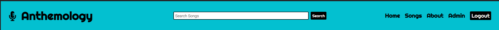
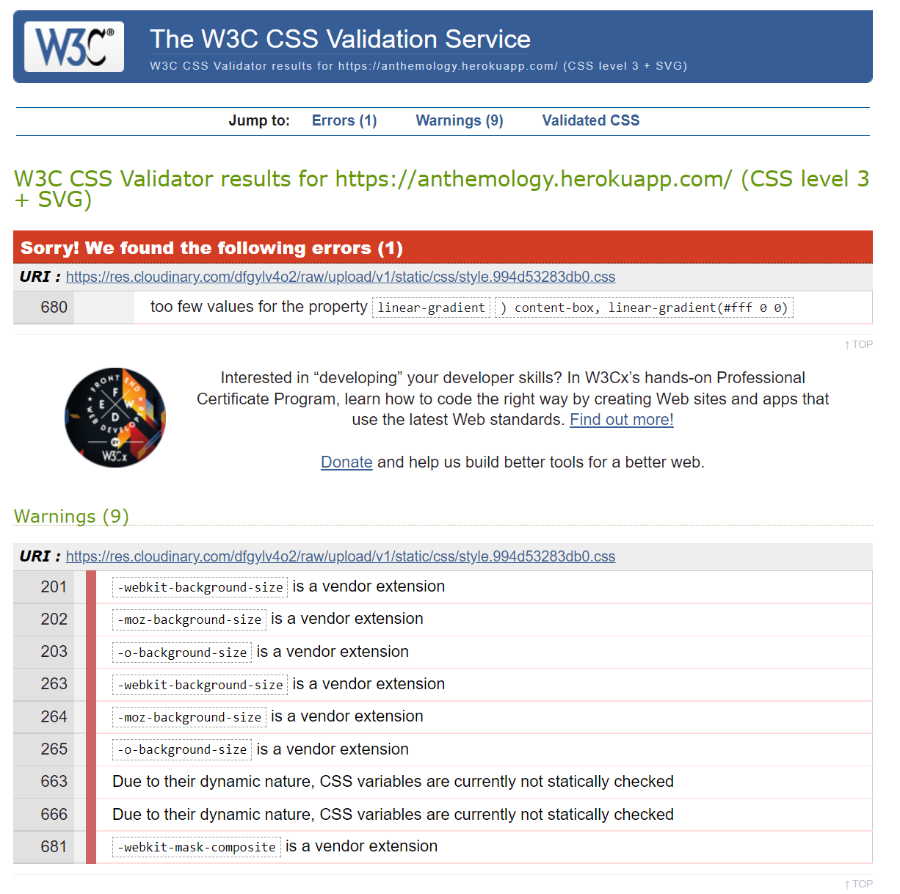

<h1 align="center">Anthemology</h1>

[Anthemology](https://anthemology.herokuapp.com/) has been developed for anyone interested in music, and singing in particular. The user can search a database of songs to find the corresponding lyrics in order to be able to sing along. The user can also add to the collection of songs, as well as edit and delete them. 

<h2 align="center"></h2>

## __User Experience (UX)__

-   ### ***User stories***

    -   #### First Time Visitor Goals

        1. As a First Time Visitor, I want to easily understand the main purpose of the site and have fun playing a virtual piano and/or a mini game.
        2. As a First Time Visitor, I want to be able to easily be able to navigate throughout the site to find content, including on how to use the virtual piano and play the game. 
        3. As a First Time Visitor, I want to locate the site creator's social media links to see their following on social media to determine how trusted and known they are.

    -   #### Returning Visitor Goals

        1. As a Returning Visitor, I want to use the sheet music to try and play along to well-known songs.
        2. As a Returning Visitor, I want to re-read the challenge instructions to try and beat the computer.
        3. As a Returning Visitor, I want to get in contact with the site creator with any questions I may have about the site.

    -   #### Frequent User Goals

        1. As a Frequent User, I want to attempt to play the sheet music songs using only the computer keyboard, without making any mistakes.
        2. As a Frequent User, I want to try and beat my personal best score on the challenge.
        3. As a Frequent User, I want to see if any new sheet music had been added.

-   ### ***Design***
    
    -   #### Colour Palette

        - The colour palette is made up of four colours: 
          - Aqua #03c0d0
          - Dark Purple #39217d
          - Black #000000
          - White #FFFFFF

        - The aqua #03c0d0 was chosen as a colourful contrast to the predominantly black and white hero images. Dark purple #39217d is used on all alerts, indicating to the user that these differ from all other elements on the site and require attention. Black #000000 and white #FFFFFF are used as the third and fourth colours on the site as neutral tones and to reiterate the hero images. Compatibility with each other, and accessibility, were taken into account for all four colours.

    -   #### Typography

        - The [Righteous](https://fonts.google.com/specimen/Righteous?query=righteous) and [Roboto](https://fonts.google.com/specimen/Roboto?query=roboto) fonts are used across the site, with 'Righteous' used for the headings and some of the body text and 'Roboto' used for the remaining text. 

        - The fonts were chosen for their playful and retro feel, and the similarity to old vinyl lettering, all the while taking into account the general feel of the site. 
    
    -   #### Imagery

        - There are two hero images throughout the site:

          - The homepage image of a collection of vinyls strewn across a surface covers the entire body of the site and is used to get the users attention when landing on the homepage. As the remaining content on this page is not text-heavy, consisting of the search function, the hero image doesn't distract from the content.

          - The remaining pages use the same hero image of half of a single vinyl seemingly dropping from the top of the page. As these pages contain a considerable amount of text and content, this was done in order not to distact from the information on the page. 

          - Both hero images are predominantly black and white and were deliberately chosen as such to give a neutral feel and allow for pops of colour elsewhere on the site. 

-   ### ***Wireframes and Mock-Ups***

    - Wireframes and mock-ups were created for the homepage and song lyric pages. These were adapted and improved upon throughout the development process. 

      -   Homepage Wireframe:
          

      -   Song Lyrics Wireframe:
          

      -   Homepage Mock-Up:
          
      
      -   Song Lyrics Mock-Up:
          

## __Features__

### ***Existing Features***

- #### Navigation Bar

  - The navigation bar includes various clickable links, allowing the user to easily access the pages on the site. Access is distinct between admin superusers and standard users, with restricted access to standard users. There is also signup, login and logout functionality which changes according to the status of the user.   
    - Sign up / login view:
    
    - Standard User Login:
    
    - Superuser Login:
    

  - The main pages on the app are:
    - Homepage
    - Songs
    - About
    - My Songs (for standard users)
    - Admin (for admin superusers)
    - Forms (signup, login, add song, edit song, delete song)

  - In order to make navigation easier for the user, the navigation bar is in a fixed position, meaning that it remains at the top of the page as the user scrolls down.

  - The navigation bar follows the same style as the footer, and appears in the same format on all pages - this allows for consistency throughout the site.

  - A hover effect of the text being underlined in white or buttons turning white, and the cursor becoming a pointer is included, allowing the user to understand that the link is clickable.

  - The navigation bar was created with HTML and CSS  and is fully responsive across devices.
    

- #### Play Page

  

  - The Play page is the landing page of the website and as the user's first port of call serves as the main purpose of the site, namely to be able to play a virtual piano - on Freestyle mode, or on Challenge mode. 
  
  - The page is split into two sections:
    - The play mode choice, including a clickable button each for Freestyle mode and Challenge mode. And the score board, including counters for the number of rounds played, the number of games won, the number of games lost, and a results message showing either "Won!" or "Lost!". A hover effect of the buttons inversing colours, and the cursor becoming a pointer is included, allowing the user to understand that the button is clickable.
    - The virtual piano, including computer keyboard keys to be used on Freestyle mode on non-touchscreen devices.

- #### Sheet Music Page

  

  - The Sheet Music page allows the user to view a selection of sheet music that they can play along to on the piano, by opening the page in a separate tab. 

  - Each piece of sheet music includes the corresponding audio file that users can listen to in order to familiarise themselves with the song. 

  - The page has a choice of seven songs:
    - The Entertainer - Scott Joplin
    - Für Elise - Ludwig van Beethoven
    - Clair de Lune - Claude Debussy
    - Canon in D - Johann Pachelbel
    - Dance of the Sugar Plum Fairy - Pyotr Ilyich Tchaikovsky
    - Greensleeves - Unknown Composer
    - Happy Birthday - Patty & Mildred J. Hill

- #### Instructions Page

  

  - The Intructions page serves to inform the user on how to play and how to use the virtual piano. 

  - The page is split into two sections:
    - How to Play - explaining to the user the difference between the two play modes and how to access them, and the use of the sheet music. 
    - Using the Virtual Piano - explaining to the user in which ways the piano can be played on various devices. 

  - The user can access a popup window in the How to Play section, detailing the rules of the challenge. A hover effect of the text turning purple, and the cursor becoming a pointer is included, allowing the user to understand that the word 'here' is clickable. A popup was used to avoid overloading the page with text, and thus discouraging the user from reading the information. 

  - A piano and computer mouse graphic were used for each of the sections, to break up the text-heavy page and instantly make clear to the user what the secions are about. The graphics use the same colours and style of the site in order to keep things coherent.  

- #### Footer

  

  - The footer follows the same style as the navigation bar, and appears in the same format on all three pages - this allows for consistency throughout the site.

  - The footer contains three elements:
    - The copyrighted site name on the left hand side. 
    - Information about the site and how it was created. 
    - Social media links, allowing the user to visit the site creator's LinkedIn and GitHub pages. Hovering over the link icons turns them purple to signal to the user that there is an interaction possible. All links are opened in separate tabs so that the user remains on the site. 

  - The footer was created with HTML and CSS only and is fully responsive across devices.

    

### ***Future Implementations***

- #### General

  - Improve Lighthouse SEO score on Play and Sheet Music pages.

  - Refactor and simplify JavaScript code, to make it easier to read and avoid any possible repetition. 

  - Improve accessibility across the site, including on audio files for the sheet music and the piano, the piano keys, and the sheet music. 

  - Include an alert to users on small devices that landscape mode is the preferred mode to play the piano on. 

- #### Navigation Bar

  - Make header invisible on smaller viewports and allow for swipe down or hover to make it appear.  

- #### Play Page

  - Include the option to play the piano with the keyboard on Challenge mode. 

  - Include a cursor pointer hover effect for the piano keys to make it clearer to the user that they are clickable.

  - Include a larger version of the virtual piano, with more notes, for very large screens.  

  - Include several versions of the Challenge to make it more interesting, such as the piano playing an actual, recognisable song, and hard and easy modes. 

  - Include audio sounds for correct and incorrect guesses on the Challenge, to further clarify what has occured to the user. 

- #### Sheet Music Page

  - Improve visuals on the iframes, such as colours fitting with the site. 

  - Find another option instead of the iframes altogether as they create bugs when loading and do not work on mobile devices. 

  - Include the sheet music on the Play page above the piano so that users can read and follow it more easily. Make it interactive also, scrolling down the page as you play, and highlighting the notes played on the screen.

- #### The Footer

  - Add a back to top arrow or button to allow the user to get back to the top of the screen easily. 

## __Technologies Used__

### ***Languages Used***

-   [HTML5](https://en.wikipedia.org/wiki/HTML5)

-   [CSS3](https://en.wikipedia.org/wiki/Cascading_Style_Sheets)

-   [JavaScript](https://en.wikipedia.org/wiki/JavaScript)

-   [Python](https://en.wikipedia.org/wiki/Python_(programming_language))

### ***Frameworks, Libraries & Programs Used***

1. [Django:](https://www.djangoproject.com/)
    - The Django web framework was used to create the full-stack web application.

1. [PostgreSQL:](https://en.wikipedia.org/wiki/PostgreSQL)
    - PostgreSQL was used as the object-relational database system.

1. [ElephantSQL:](https://www.elephantsql.com/)
    - ElephantSQL was used to host the database.

1. [Git:](https://git-scm.com/)
    - Git was used for version control by utilizing the Gitpod terminal to commit to Git and Push to GitHub.

1. [GitHub:](https://github.com/)
    - GitHub is used to store the projects code after being pushed from Git.

1. [Heroku:](https://heroku.com/)
    - Heroku was used for the deployed application.

1. [Chrome DevTools:](https://developer.chrome.com/docs/devtools/)
    - Chrome DevTools was used to consistently check the site in terms of responsivity, performance, accessibility, best practice and SEO.

1. [Google Fonts:](https://fonts.google.com/)
    - Google Fonts was used to import the ''Orelega One' and 'Poppins' fonts into the style.css file which is used on all pages throughout the project. [Orelega One](https://fonts.google.com/specimen/Orelega+One?query=orelega) for the headings and [Poppins](https://fonts.google.com/specimen/Poppins?query=poppins) is used for the remaining text.

1. [Font Awesome:](https://fontawesome.com/)
    - Font Awesome was used on all pages throughout the website to add icons for aesthetic and UX purposes.

1. [Font Awesome Favicon Generator:](https://gauger.io/fonticon/)
    - Font Awesome Favicon Generator was used to reproduce a favicon version of the [Font Awesome Music Icon](https://fontawesome.com/icons/music?s=solid) used in the header site name.

1. [Canva:](https://www.canva.com/)
    - Canva was used to create the wireframes and mock-ups during the design process. As well as the vinyl graphic, and adjustement of hero images. 

1. [Pexels](https://www.pexels.com/) and [Unsplash:](https://unsplash.com/)
    - Pexels and Unsplash wre used to find the hero images.

## __Testing__

### ***HTML, CSS and JavaScript Testing***

-   [W3C Markup Validator](https://jigsaw.w3.org/css-validator/#validate_by_input) was used to validate every page of the project to ensure there were no HTML syntax errors in the project.
    - [Results index.html](assets/testing/testing-html-index.pdf)
    - [Results sheet-music.html](assets/testing/testing-html-sheet-music.pdf)
    - [Results instructions.html](assets/testing/testing-html-instructions.pdf)

-   [W3C CSS Validator](https://jigsaw.w3.org/css-validator/#validate_by_input) was used to validate every page of the project to ensure there were no CSS syntax errors in the project. There was 1 error and 9 warnings, all related to the jukebox feature on the Song Lyrics page, which was code taken from CSS Tricks and therefore taken as a trusted source. 
    - 

-   [JS Hint](https://jshint.com/) was used to validate every page of the project to ensure there were no JavScript errors in the project.
    - [Results script.js](assets/testing/testing-js-script.pdf)
    - [Results play.js](assets/testing/testing-js-play.pdf)
    - [Results instructions.js](assets/testing/testing-js-instructions.pdf)

### ***Performance, Accessibility, Best Practices, and SEO Testing***

  - [Chrome DevTools Lighthouse](https://developers.google.com/web/tools/lighthouse) was used to test Performance, Accessibility, Best Practices and SEO. All tests performed in the 90-100 green score, except for in the SEO category on some pages that came just below in the yellow range. 
    - The Play page scored 89 on desktop.
    - The Sheet Music page scored 89 on desktop.

- #### Desktop Testing with [Chrome DevTools Lighthouse](https://developers.google.com/web/tools/lighthouse)

  - [Play Page](assets/testing/testing-lighthouse-index-desktop.pdf)
  - [Sheet Music Page](assets/testing/testing-lighthouse-sheet-music-desktop.pdf)
  - [Instructions Page](assets/testing/testing-lighthouse-instructions-desktop.pdf)

- #### Mobile Testing with [Chrome DevTools Lighthouse](https://developers.google.com/web/tools/lighthouse)

  - [Play Page](assets/testing/testing-lighthouse-index-mobile.pdf)
  - [Sheet Music Page](assets/testing/testing-lighthouse-sheet-music-mobile.pdf)
  - [Instructions Page](assets/testing/testing-lighthouse-instructions-mobile.pdf)

- #### Further Accessibility Testing

  - [EightShapes Contrast Grid](http://eightshapes.com/) was used to test the colour palette of the site for any accessibility issues. Only AAA and AA rating options were used on the site. 
  
  
  - Any icons on the site that are for decorative purposes only use the aria-hidden="true" attribute to accommodate for accessibility, as recommended by [Font Awesome's Accessiblity Page](https://fontawesome.com/v5/docs/web/other-topics/accessibility)

### ***Responsive Testing***

  - [Chrome DevTools](https://developer.chrome.com/docs/devtools/) and [Responsinator](https://www.responsinator.com/) were used to regularly check for any responsive design issues. Rather than only checking for specific device screen widths, I used DevTools to reduce the viewport width gradually and noted any and all issues for each width. My media queries are based on these specific pixel widths rather than typical viewport breakpoints to allow for an enjoyable experience for all users, on any devices they use. 

  - The site is responsive down to 320px viewport widths.  

### ***Testing User Stories from User Experience (UX) Section***

-   #### First Time Visitor Goals

    1. As a First Time Visitor, I want to easily understand the main purpose of the site and have fun playing a virtual piano and/or a mini game.

        1. Upon entering the site, users are automatically greeted with a clean and easily readable navigation bar to go to the page of their choice. Underneath, the user discovers the main content of the page.
        2. The main point of the site is made immediately clear with an invitation to choose your playing mode, seeing the as yet empty score board, and finally the virtual piano itself.  
        3. The user has the option to start playing immediately, by intuitively clicking on the Freestyle or Challenge button. If the rules of the challenge are not clear from playing, the user can easily navigate to the Instructions page to find out how to play.    

    2. As a First Time Visitor, I want to be able to easily be able to navigate throughout the site to find content, including on how to use the virtual piano and play the game.

        1. The site has been designed to be fluid and never to entrap the user. At the top of each page there is a clean navigation bar, each link clearly describes what page they will end up on. There is also a visual aid in the form of colours to help the user understand which page they are on: purple for the current page, black for the other pages they can click on to visit. 
        2. The navigation bar is in the fixed position and thus stays at the top of the page as the user navigates the site, allowing the user to easily switch between pages and get back to the top of the page again by clicking on the page link they are currently on. 
        3. On smaller viewports the navigation bar remains fixed, but is reduced in size as to not take up too much space, and includes the site name only, which remains clickable. In order to access the other site pages there is a hamburger bar to the right of the site name, which pops out below the site name and disappears again once the desired page has been selected. 
        4. The Instructions page greets the user with visual aids in the form of graphics, as well as clear headings, making it immediately clear what each section is about. A popup explains in detail what the challenge rules are, ensuring the user doesn't get frustrated trying to play the game. 

    3. As a First Time Visitor, I want to locate the site creator's social media links to see their following on social media to determine how trusted and known they are.

        1. The user can scroll to the bottom of any page on the site to locate social media links in the footer.

-   #### Returning Visitor Goals

    1. As a Returning Visitor, I want to use the sheet music to try and play along to well-known songs.

        1. The navigation bar clearly highlights the Sheet Music page.
        2. Each piece of sheet music includes a playable audio file of the song, allowing the user to familiarise themselves with the song if they do not know it. 
        3. The sheet music can be opened in a separate tab and used on a secondary computer screen to play along. It can also be downloaded, printed, and the zoom and page fit adjusted to enable a comfortable experience for the user. 

    2. As a Returning Visitor, I want to re-read the challenge instructions to try and beat the computer.

        1. The navigation bar clearly highlights the Instructions page.
        2. In the How to Play section, a hover effect turning the word 'here' purple and the cursor to a pointer make it clear to the user that this is a clickable element.   
        3. The popup detailing the rules of the challenge is clean, easy to read and explains thorougly how to play.  

    3. As a Returning Visitor, I want to get in contact with the site creator with any questions I may have about the site.

        1. The footer contains links to the site creator's GitHub and Linkedin pages.
        2. Whichever link they click, it will be opened up in a new tab to ensure the user can easily get back to the website.

-   #### Frequent User Goals

    1. As a Frequent User, I want to attempt to play the sheet music songs using only the computer keyboard, without making any mistakes.

        1. The user would already be comfortable with the website layout and could easily find the Play and Sheet Music pages in the navigation bar.
        2. The user would already be familiar with how to use the sheet music and listen to the corresponding audio. 
        3. The computer keyboard keys to be used are clearly indicated on the piano keys, thus facilitating their use. 

    2. As a Frequent User, I want to try and beat my personal best score on the challenge.

        1. The user would already be comfortable with the website layout and could easily find the Play Page in the navigation bar. 
        2. Having noted their previous results, the user would easily be able to keep track of the clear and self-explanatory score board. 

    3. As a Frequent User, I want to see if any new sheet music had been added.

        1. The user would already be comfortable with the website layout and could easily find the Sheet Music page in the navigation bar.
        2. Here they would quickly see if any new sheet music had been added to the list.  

### ***Further Testing***

-   The Website was tested on Google Chrome, Firefox, and Microsoft Edge browsers.

-   The website was viewed on a variety of devices such as Desktop up to 28 inch screen with 4k resolution, Laptop, Pixel 3a, Pixel 4, Samsung Galaxy Tab S5e.

-   A large amount of testing was done to ensure that all pages were linking correctly.

-   Friends and family members were asked to review the site and documentation to point out any bugs and/or user experience issues.

### ***Fixed Bugs***

- Initially `style.backgroundColor` was used on the Challenge mode of the piano to achieve a purple coloured piano key as it was played - see example `function twenty()` below. This was followed by a `clearKeyLights function`, resetting the `style.backgroundColor` to white and black respectively - see `function clearKeyLights` below. This however caused a bug when switching to Freestyle mode after having played Challenge mode: the purple colour no longer appeared when playing the notes. This was due to the `style.backgroundColor` taking precedence over the `.active` class used on Freestyle mode. The bug was fixed by applying an `.active` class on the Challenge as well - see `function nineteen()` example below. 
  - Key Colour Bug Add Colours:
  
    
  
  - Key Colour Bug Clear Colours:
  
    

### ***Known Bugs***

- The iframe containing the sheet music on the Sheet Music Page doesn't always load, requiring a hard refresh (ctrl + shift + R) - see example below. Chrome DevTools revealed the issue being that `<!DOCTYPE html>` hadn't been called and the site was therefore being loaded in Quirks Mode - see example below. However, `<!DOCTYPE html>` is present on all html pages, and this issue could therefore not be resolved. 
  
  - iframe Bug:
    
  
  - iframe Bug Quirks Mode:
    

- The iframe is also incompatible with most smaller devices as they are unable to display pdfs within the iframe. The user is required to open them in a separate viewer. Given that users are unlikely to play along to the sheet music on a mobile device this bug was accepted and noted for future improvements. 

- Occasionally the virtual piano has played several notes at once without explanation on the Challenge mode. This bug appears to be resolved but is noted nonetheless in case some users experience this.  

## __Deployment__

### ***GitHub Pages***

The project was deployed to GitHub Pages using the following steps:

1. Log in to GitHub and locate the [PiaNotes GitHub Repository](https://github.com/AlexaH88/pianotes)
2. At the top of the Repository (not top of page), locate the "Settings" Button on the menu.
    - Alternatively Click [Here](https://raw.githubusercontent.com/) for a GIF demonstrating the process starting from Step 2.
3. Scroll down the Settings page until you locate the "GitHub Pages" Section.
4. Under "Source", click the dropdown called "None" and select "Master Branch".
5. The page will automatically refresh.
6. Scroll back down through the page to locate the now published site [link](https://alexah88.github.io/pianotes/) in the "GitHub Pages" section.

### ***Forking the GitHub Repository***

By forking the GitHub Repository we make a copy of the original repository on our GitHub account to view and/or make changes without affecting the original repository by using the following steps:

1. Log in to GitHub and locate the [PiaNotes GitHub Repository](https://github.com/AlexaH88/pianotes)
2. At the top of the Repository (not top of page) just above the "Settings" Button on the menu, locate the "Fork" Button.
3. You should now have a copy of the original repository in your GitHub account.

### ***Making a Local Clone***

1. Log in to GitHub and locate the [PiaNotes GitHub Repository](https://github.com/AlexaH88/pianotes)
2. Under the repository name, click "Clone or download".
3. To clone the repository using HTTPS, under "Clone with HTTPS", copy the link.
4. Open Git Bash
5. Change the current working directory to the location where you want the cloned directory to be made.
6. Type `git clone`, and then paste the URL you copied in Step 3.

```
$ git clone https://github.com/AlexaH88/pianotes
```

7. Press Enter. Your local clone will be created.

```
$ git clone https://github.com/AlexaH88/pianotes
> Cloning into `CI-Clone`...
> remote: Counting objects: 10, done.
> remote: Compressing objects: 100% (8/8), done.
> remove: Total 10 (delta 1), reused 10 (delta 1)
> Unpacking objects: 100% (10/10), done.
```

Click [Here](https://help.github.com/en/github/creating-cloning-and-archiving-repositories/cloning-a-repository#cloning-a-repository-to-github-desktop) to retrieve pictures for some of the buttons and more detailed explanations of the above process.

## __Credits__

### ***Code***

- The following were used as references to help with writing the HTML, CSS, JavaScript and Python code:
  - [Code Institute LMS](https://learn.codeinstitute.net/ci_program/diplomainsoftwaredevelopmentecommerce), in particular the [CI I Think Therefore I Blog Walkthrough](https://learn.codeinstitute.net/courses/course-v1:CodeInstitute+FST101+2021_T1/courseware/b31493372e764469823578613d11036b/fe4299adcd6743328183aab4e7ec5d13/)
  - [W3Schools](https://www.w3schools.com/) 
  - [Stack Overflow](https://stackoverflow.com/)
  - [MDN Web Docs](https://developer.mozilla.org/en-US/)
  - [Django Documentation](https://docs.djangoproject.com/en/4.1/)

- The hero image full background cover was taken from [Nicolas Lule](https://nicolaslule.com/responsive-full-width-hero-image-using-flex/) and adapted.

- The Search Bar functionality was taken from [Codemy](https://www.youtube.com/watch?v=AGtae4L5BbI) and adapted. 

- The alert messages close buttons were taken from [W3Schools](https://www.w3schools.com/howto/howto_js_alert.asp) and adapted.

- The jukebox animation on the Song Lyrics page was taken from and inspired by [CSS Tricks](https://css-tricks.com/css-only-infinite-and-circular-image-slider/) and adapted.

- The code for the scroll effect on the lyrics on the Song Lyrics page and the songs throughout the app when there is a lot of data was taken from [W3Schools](https://www.w3schools.com/cssref/pr_scroll-behavior.php) and adapted. 

- The Delete Song form view and templates were taken from [OpenClassrooms](https://openclassrooms.com/fr/courses/6967196-create-a-web-application-with-django/7349788-delete-objects-safely-with-user-confirmation) and adapted.

- The slug being automatically created from the song title was taken from [AppsLoveWorld](https://www.appsloveworld.com/django/100/279/pre-populate-slug-field-into-a-form-field-of-a-django-site) and adapted.

- The input fields when adding or editing a song automatically being capitalised were taken from [LearnPython](https://learnpython.com/blog/uppercase-letter-python/) and [Google Groups](https://groups.google.com/g/django-users/c/gbU-pfCgCL8?pli=1) respectively and adapted.

- The favicon code was taken from [W3Schools](https://www.w3schools.com/), specifically from [HTML Favicon](https://www.w3schools.com/html/html_favicon.asp) and adapted.

### ***Content***

- All text content was written by the site creator [Alexa Hendry](https://github.com/AlexaH88). 

### ***Media***

- The two hero images were taken from [Pexels](https://www.pexels.com/) and [Unsplash](https://unsplash.com/) respectively and are credited as follows:

  - [Homepage Hero Image](https://unsplash.com/photos/iRjOMSpZaEE) by [Miriana Dorobanțu](https://unsplash.com/@mirianaa_)

  - [Main Hero Image](https://www.pexels.com/photo/black-record-vinyl-167092/) by [Miguel Á. Padriñán](https://www.pexels.com/@padrinan/)

- The [vinyl graphic](https://www.canva.com/icons/MAFM8W9r2EI-retro-disc-vinyl-sticker/) on the Song Lyrics page was taken from graphic designer [Deadframe Works Images](https://www.canva.com/p/deadframes/) via [Canva](https://www.canva.com/).

### ***Acknowledgements***

Massive thanks to: 

- My mentor, [Darío Carrasquel](https://github.com/jeetkunecoder), for guiding me and giving me helpful feedback and advice. 

- My fellow Code Institute students and friends for their help, generous feedback, and incredible knowledge:
  
  - [Abi Harrison](https://github.com/Abibubble)
  - [Dave Horrocks](https://github.com/DaveyJH)
  - [Emanuel Silva](https://github.com/manni8436)
  - [Kera Cudmore](https://github.com/kera-cudmore)
  - [Megan Vella](https://github.com/Medusas71)
  - [Natalie Alexander](https://github.com/natalie-kate)
  - [Sandra Atino](https://github.com/Atinos31)
  - [Suzy Bennett](https://github.com/suzybee1987)

- Tutor Support, Student Care and the Slack Community at [Code Institute](https://codeinstitute.net/global/) for their support.

- And last but not least, my fiancé [Antoine Masson](https://www.linkedin.com/in/antoine-masson-55b65094/) for helping me through the stressful moments and for supporting us financially while I make this big career change. 