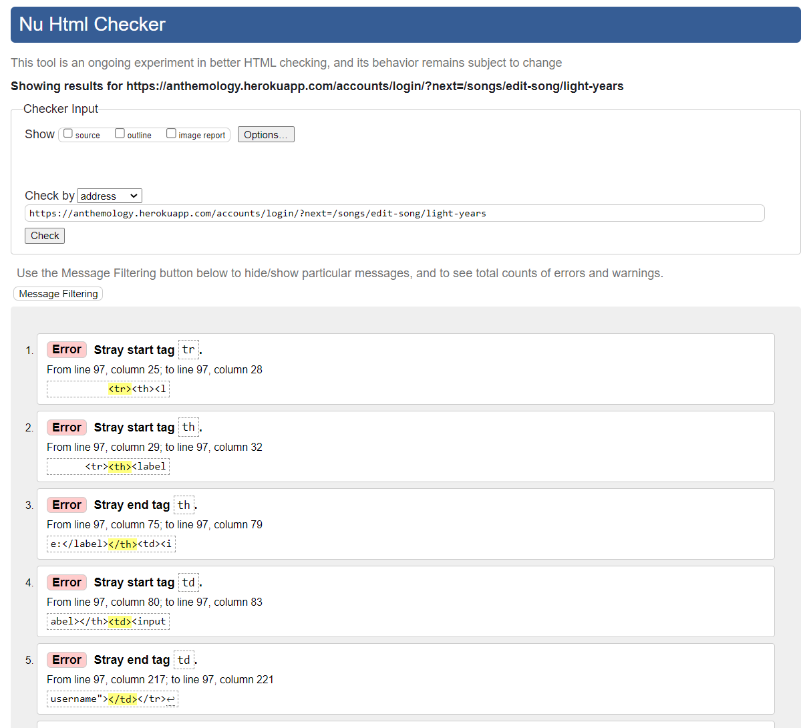
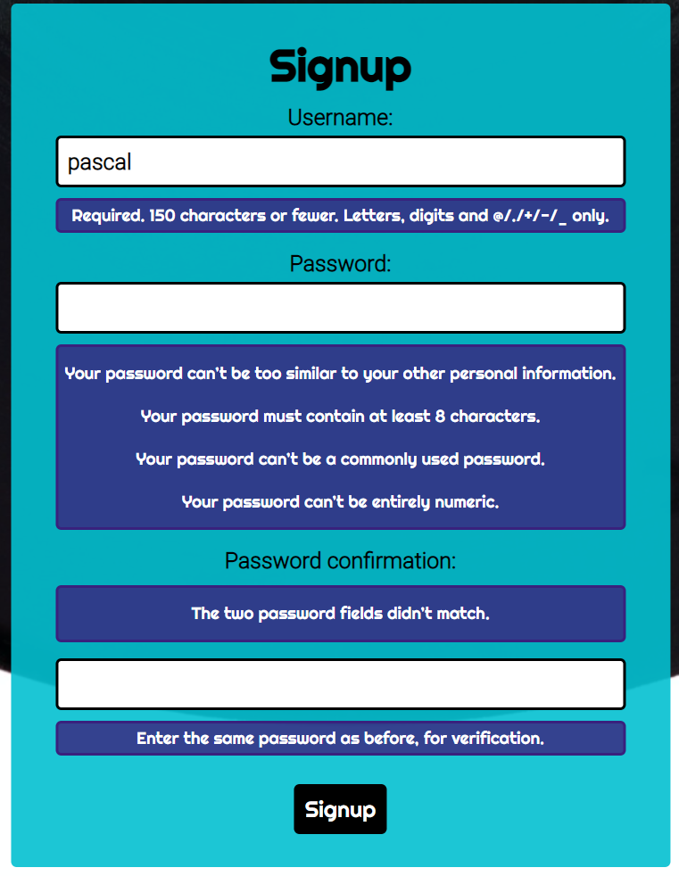
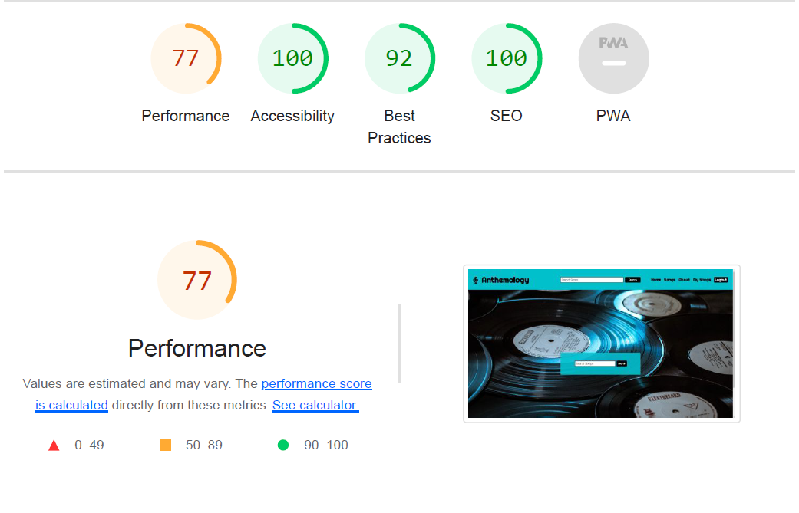
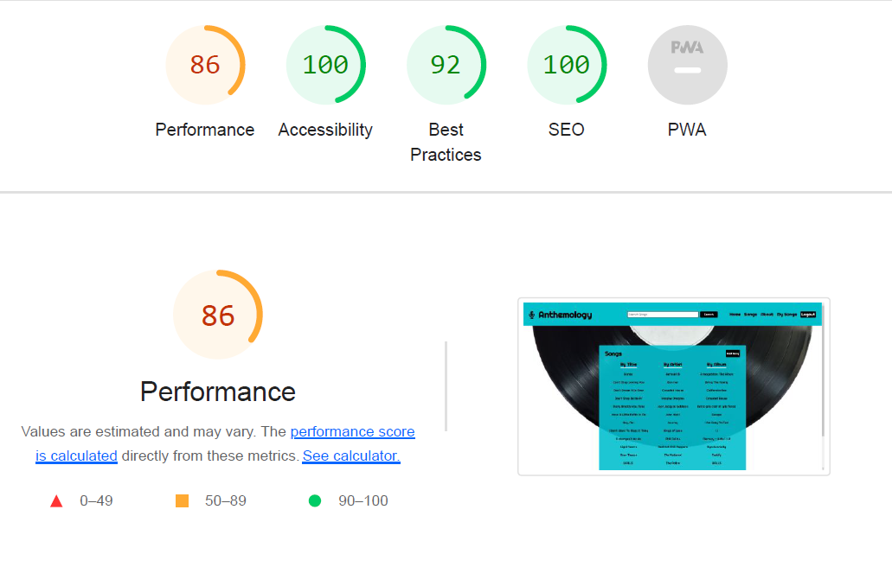
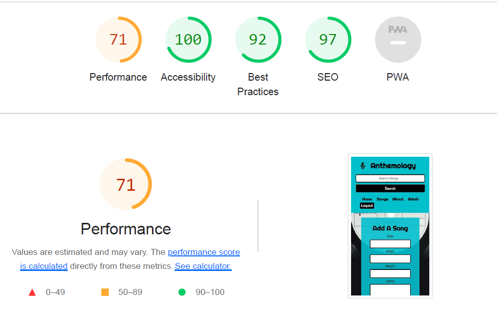
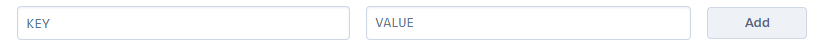

<h1 align="center">Anthemology</h1>

[Anthemology](https://anthemology.onrender.com) has been developed for anyone interested in music, and singing in particular. The user can search a database of songs to find the corresponding lyrics in order to be able to sing along. The user can also add to the collection of songs, as well as edit and delete them. 

<h2 align="center"></h2>

## __User Experience (UX)__

-   ### ***User stories***

    -   #### First Time Visitor Goals

        1. As a First Tiem Visitor I can use a search bar on the homepage so that I can easily find the song I'm looking for.

    -   #### Returning Visitor Goals

        1. As a Returning Visitor I can sign up for an account so that I can create, edit and delete lyrics.
        2. As a Returning Visitor I can login to an account so that I can access my songs as a returning user.
        3. As a Returning Visitor I can logout of an account so that I remove access to anyone else using the computer

    -   #### Frequent User Goals

        1. As a Frequent User (Site User / Site Admin) I can create song lyrics so that other users can find the lyrics to their favourite songs.
        2. As a Frequent User (Site User / Site Admin) I can edit song lyrics that I've created so that I can modify the content if needed.
        3. As a Frequent User (Site User / Site Admin) I can delete song lyrics that I've created so that I can remove my contribution if needed.

-   ### ***Design***
    
    -   #### Colour Palette

        - The colour palette is made up of four colours: 
          - Aqua #03c0d0
          - Dark Purple #39217d
          - Black #000000
          - White #FFFFFF

        - The aqua #03c0d0 was chosen as a colourful contrast to the predominantly black and white hero images. Dark purple #39217d is used on all alerts, indicating to the user that these differ from all other elements on the site and require attention. Black #000000 and white #FFFFFF are used as the third and fourth colours on the site as neutral tones and to reiterate the hero images. Compatibility with each other, and accessibility, were taken into account for all four colours.

    -   #### Typography

        - The [Righteous](https://fonts.google.com/specimen/Righteous?query=righteous) and [Roboto](https://fonts.google.com/specimen/Roboto?query=roboto) fonts are used across the site, with 'Righteous' used for the headings and some of the body text and 'Roboto' used for the remaining text. 

        - The fonts were chosen for their playful and retro feel, and the similarity to old vinyl lettering, all the while taking into account the general feel of the site. 
    
    -   #### Imagery

        - There are two hero images throughout the site:

          - The homepage image of a collection of vinyls strewn across a surface covers the entire body of the site and is used to get the users attention when landing on the homepage. As the remaining content on this page is not text-heavy, consisting of the search function, the hero image doesn't distract from the content.

          - The remaining pages use the same hero image of half of a single vinyl seemingly dropping from the top of the page. As these pages contain a considerable amount of text and content, this was done in order not to distact from the information on the page. 

          - Both hero images are predominantly black and white and were deliberately chosen as such to give a neutral feel and allow for pops of colour elsewhere on the site. 

-   ### ***Wireframes and Mock-Ups***

    - Wireframes and mock-ups were created for the homepage and song lyric pages. These were adapted and improved upon throughout the development process. 

      -   Homepage Wireframe:
          

      -   Song Lyrics Wireframe:
          

      -   Homepage Mock-Up:
          
      
      -   Song Lyrics Mock-Up:
          

-   ### ***Entity Relationship Diagram***

    - The following Entity Relationship Diagram was created to show the models used. The in-built Django User model was used for this project, and a unique Song model was created with the fields in purple included. 

    - The fields in blue are could have features that are discussed in the Future Implementations section of this document.  

      -   Entity Relationship Diagram:
          

## __Features__

### ***Existing Features***

- #### Navigation Bar

  - The navigation bar includes various clickable links, allowing the user to easily access the pages on the site. Access is distinct between admin superusers and standard users, with restricted access to standard users. There is also signup, login and logout functionality which changes according to the status of the user.   
    - Sign up / login view:
    
    - Standard User Login:
    
    - Superuser Login:
    

  - The main pages on the app are:
    - Homepage
    - Search
    - Songs
    - About
    - My Songs (for standard users)
    - Admin (for admin superusers)
    - Forms (signup, login, add song, edit song, delete song)

  - In order to make navigation easier for the user, the navigation bar is in a fixed position, meaning that it remains at the top of the page as the user scrolls down.

  - The navigation bar follows the same style as the footer, and appears in the same format on all pages - this allows for consistency throughout the site.

  - A hover effect of the text being underlined in white or buttons turning white, and the cursor becoming a pointer is included, allowing the user to understand that the link is clickable.

  - The navigation bar was created with HTML and CSS  and is fully responsive across devices.
    

- #### Homepage

  

  - The homepage is the user's first port of call and consists of a captive hero image of vinyls strewn across a surface, immediately introducing the musical theme of the app. 

  - The feaature here is the search bar, allowing the user to easily search the database of songs. This page was deliberately kept minimalist so as not to overwhelm the user upon arrival. 

- #### Search Page

  

  - The Search page gives the user all the songs that match their searched keyword, whether it be in the title, artist or album name of the song. 

  - The page also has a hero image of half a vinyl that appears to drops down from the top of the screen. This hero image features on all pages other than the homepage and the song detail page.

- #### Songs Page

  

  - The Songs page allows the user to view all the songs that have been uploaded into the database, by both admin and regular users. 

  - The page consists of a table showing alphabetically sorted entried by Title, by Artist and by Album.

- #### Song Lyrics Page

  

  - The Song Lyrics page contains the lyrics of the selected song, displayed over the same hero image as the homepage. 

  - A playful touch is added with the animated jukebox, showing the song title, artist, album, and who the song was added by and when. 

- #### About Page

  

  - The About page serves to inform the user on what the app is about and how to create, edit and delete songs.

- #### My Songs Page

  

  - The My Songs page is only accessible to logged in users, and to standard users specifically. This page informs the user how to add, edit and delete songs, and shows a list of songs created by the user - or a message explaining that none have been added yet.

  - This page allows the user to edit and delete their own songs only, ensuring the appropriate level of access rights.

- #### Admin Page

  

  - The Admin page is only accessible to logged in users, and to superusers specifically. This page informs the superuser how to add, edit and delete songs, and shows a list of all songs in the database.

  - This page allows the superuser to edit and delete absolutely every single song, ensuring the appropriate level of access rights.

- #### Signup Page

  

  - The Signup page is only accessible is logged out. This page consists of a form to be completed in order to sign up and create an account.

  - The form includes warning and error messages on input, ensuring the user is always informed about required or incorrect input.

  - Once a user has signed up, they are informed via a message alert at the top of the page, which they can close at their convenience.

- #### Login Page

  

  - The Login page is only accessible is logged out. This page consists of a form to be completed in order to login to an existing account.

  - The form includes warning and error messages on input, ensuring the user is always informed about required or incorrect input.

  - Once a user has logged in, they are informed via a message alert at the top of the page, which they can close at their convenience.

- #### Add Song Page

  

  - The Add Song page is only accessible to logged in users. This page consists of a form to be completed in order to add a song, with song title, artist, album and lyrics input fields.

  - The form includes warning and error messages on input, ensuring the user is always informed about required or incorrect input.

  - Once a song has been added the user is informed via a message alert at the top of the page, which they can close at their convenience. 

- #### Edit Song Page

  

  - The Edit Song page is only accessible to logged in users. This page consists of a form to be completed in order to edit a song, with song title, artist, album and lyrics input fields. These fields are pre-populated with the current information held on the selected song, and can be edited as desired. 

  - The form includes warning and error messages on input, ensuring the user is always informed about required or incorrect input.

  - Once a song has been edited the user is informed via a message alert at the top of the page, which they can close at their convenience. 

- #### Delete Song Page

  

  - The Delete Song page is only accessible to logged in users. This page consists of a prompt allowing the user to change their minds if they clicked on the delete song button by mistake. Once the delete button is pressed the selected song is deleted. 

    - Once a song has been deleted the user is informed via a message alert at the top of the page, which they can close at their convenience. 

- #### Footer

  

  - The footer follows the same style as the navigation bar, and appears in the same format on all pages - this allows for consistency throughout the site.

  - The footer contains three elements:
    - The copyrighted site name on the left hand side. 
    - Information about the site and how it was created. 
    - Social media links, allowing the user to visit the site creator's LinkedIn and GitHub pages. Hovering over the link icons turns them purple to signal to the user that there is an interaction possible. All links are opened in separate tabs so that the user remains on the site. 

  - The footer was created with HTML and CSS only and is fully responsive across devices.

    

### ***Future Implementations***

- #### General

  - Expand the song content to include instrumental chords to allow users to play along. 

  - Create an account or profile page for standard users, for them to personalise their account further, with a profile picture for example. Allow for the user to edit, and delete their account. 

  - Create a comments feature (model) on the songs to allow for social interaction and the building of a community.

  - Create a rating feature (model) on the songs to allow for social interaction and the building of a community.

  - Enable users to include the album artwork when creating a song, as well as the corresponding music video. 

  - Improve the Lighthouse Performance score across devices.

- #### Navigation Bar

  - Make header invisible on smaller viewports and allow for swipe down or hover to make it appear.

- #### Songs Page

  - Create a better way of displaying the songs, especially as the database grows, such as having separate pages each for viewing song titles, artists, and albums or a filter at the top of the page to specify the request.

  - Avoid showing duplicates of artists, or albums for example in the same list. Instead show the name only once, and allow the user to click through to a page for that artist for example with all songs associated with it. And from there the song lyrics page can be accessed.

  - The duplicate entries can currently be handled manually by a superuser in order to keep the song table clean.

- #### Song Lyrics Page

  - Implement auto-scrolling on the lyrics, including the option to slow them down or speed them up according to user preference. 

## __Technologies Used__

### ***Languages Used***

-   [HTML5](https://en.wikipedia.org/wiki/HTML5)

-   [CSS3](https://en.wikipedia.org/wiki/Cascading_Style_Sheets)

-   [JavaScript](https://en.wikipedia.org/wiki/JavaScript)

-   [Python](https://en.wikipedia.org/wiki/Python_(programming_language))

### ***Frameworks, Libraries & Programs Used***

1. [Django:](https://www.djangoproject.com/)
    - The Django web framework was used to create the full-stack web application.

1. [PostgreSQL:](https://en.wikipedia.org/wiki/PostgreSQL)
    - PostgreSQL was used as the object-relational database system.

1. [ElephantSQL:](https://www.elephantsql.com/)
    - ElephantSQL was used to host the database.

1. [Git:](https://git-scm.com/)
    - Git was used for version control by utilizing the Gitpod terminal to commit to Git and Push to GitHub.

1. [GitHub:](https://github.com/)
    - GitHub is used to store the projects code after being pushed from Git.

1. [Heroku:](https://heroku.com/)
    - Heroku was used for the deployed application.

1. [Chrome DevTools:](https://developer.chrome.com/docs/devtools/)
    - Chrome DevTools was used to consistently check the site in terms of responsivity, performance, accessibility, best practice and SEO.

1. [Google Fonts:](https://fonts.google.com/)
    - Google Fonts was used to import the ''Orelega One' and 'Poppins' fonts into the style.css file which is used on all pages throughout the project. [Orelega One](https://fonts.google.com/specimen/Orelega+One?query=orelega) for the headings and [Poppins](https://fonts.google.com/specimen/Poppins?query=poppins) is used for the remaining text.

1. [Font Awesome:](https://fontawesome.com/)
    - Font Awesome was used on all pages throughout the website to add icons for aesthetic and UX purposes.

1. [Font Awesome Favicon Generator:](https://gauger.io/fonticon/)
    - Font Awesome Favicon Generator was used to reproduce a favicon version of the [Font Awesome Music Icon](https://fontawesome.com/icons/music?s=solid) used in the header site name.

1. [Canva:](https://www.canva.com/)
    - Canva was used to create the wireframes and mock-ups during the design process. As well as the vinyl graphic, and adjustement of hero images. 

1. [Pexels](https://www.pexels.com/) and [Unsplash:](https://unsplash.com/)
    - Pexels and Unsplash wre used to find the hero images.

## __Testing__

### ***HTML, CSS , JavaScript and Python Testing***

-   [W3C Markup Validator](https://jigsaw.w3.org/css-validator/#validate_by_input) was used to validate every page of the project to ensure there were no HTML syntax errors in the project.

  - Due to the nature of Django, performing validation via the URL for the signup and login pages throws multiple errors regarding table elements. As modern browsers appear to be intelligent enough to remove all the child elements of a table if the parent table element is not present, I have copied the rendered HTML from DevTools and pasted it into the text input option of the validator. I have also removed the long FontAwesome section from the head for these, as I feel this is not relevant for this test.
  
  

  - All test results:
  
  
  
  
  
  
  
  
  
  
  

-   [W3C CSS Validator](https://jigsaw.w3.org/css-validator/#validate_by_input) was used to validate every page of the project to ensure there were no CSS syntax errors in the project.
    
    

-   [JS Hint](https://jshint.com/) was used to validate the very minimal JavaScript in this project.
    

-   [CI Python Linter](https://pep8ci.herokuapp.com/) was used to validate the Python code in this project. All code passed without errors, except `settings.py` and `env.py` which showed E501 'line too long' warnings.
    
    
    

### ***Manual Testing***

- Manual testing was performed app-wide to ensure a smooth and positive user experience. 

- Consistent testing was carried out to ensure there was a logical flow when using the app, and that user's expectations for where links would take them, and what would follow user actions were respected.

- Alert messages are displayed when a user has completed an action, to explain why they are not seeing any data, or if input is incorrect or required:
  
  
  
  
  
  
  
  
  
  
  

### ***Performance, Accessibility, Best Practices, and SEO Testing***

  - [Chrome DevTools Lighthouse](https://developers.google.com/web/tools/lighthouse) was used to test Performance, Accessibility, Best Practices and SEO. All tests performed in the 90-100 green score, except for in the Performance category that came just below in the yellow range. 

- #### Desktop Testing with [Chrome DevTools Lighthouse](https://developers.google.com/web/tools/lighthouse)

  
  
  
  
  
  
  
  
  
  
  

- #### Mobile Testing with [Chrome DevTools Lighthouse](https://developers.google.com/web/tools/lighthouse)

  
  
  
  
  
  
  
  
  
  
  

- #### Further Accessibility Testing

  - [EightShapes Contrast Grid](http://eightshapes.com/) was used to test the colour palette of the site for any accessibility issues. Only AAA and AA rating options were used on the site. 
  
  
  - Any icons on the site that are for decorative purposes only use the aria-hidden="true" attribute to accommodate for accessibility, as recommended by [Font Awesome's Accessiblity Page](https://fontawesome.com/v5/docs/web/other-topics/accessibility)

### ***Responsive Testing***

  - [Chrome DevTools](https://developer.chrome.com/docs/devtools/) was used to regularly check for any responsive design issues. The media queries are the same as the DevTools breakpoints. 

  - The site is responsive down to 320px viewport widths.  

### ***Further Testing***

-   The Website was tested on Google Chrome, Firefox, and Microsoft Edge browsers.

-   The website was viewed on a variety of devices such as Desktop up to 28 inch screen with 4k resolution, Laptop, Pixel 3a, Pixel 4, Samsung Galaxy Tab S5e, iPhone 11.

-   A large amount of testing was done to ensure that all pages were linking correctly.

-   Friends and family members were asked to review the site and documentation to point out any bugs and/or user experience issues.

### ***Fixed Bugs***

  - There was an issue on touchscreen devices regarding the hero images. When scrolling the image appeared to jump or zoom, creating a visually unappealing experience for the user. After trying various fixes, a solution was found on [Stack Overflow](https://stackoverflow.com/questions/20443574/fixed-background-image-with-ios7). The `background-attachment` on the hero image containers was set to scroll instead of fixed for mobile devices. The fixed `background-attachment` is not supported for mobile, which was causing this issue.

  - After having implemented the `slugify` function on the `song.title` in the `Song` model an error would appear in development but not in the deployed app:
    - If a user tried to create a song with the same title, but not the same letter case, an error was thrown as the slug already existed, as it is always lowercase.
    - The workaround was to add auto capitalization on the form on the CSS side, and `.title()` on a `save()` function within the Song model.
    - An error message was also added to ensure the user receiving the appropriate feedback regarding an already existing title. 

  - The Delete Song form initially re-used the same template as the Edit Song page, meaning that although the requested song could indeed be deleted, there was also the possibility to users inputting new content into the pre-populated fields. This was fixed by implementing a non-editable form instead, by merely showing the song info, and keeping the delete button functionality.

  - When editing and deleting songs as a superuser, the exisitng edit and delete views, causing a somewhat illogical flow for the user as it rendered the My Songs page, having been on the Admin page. Conditional statements were included in these views to establish whether the user was a superuser or not and act accordingly. The My Songs page was also dropped for the superuser, to avoid the display of similar information and potentially causing confusion or overkill for the user.  

### ***Known Bugs***

  - Not a bug per se but something that decreases UX on the app is the mobile version of large data list of the songs. This is mentioned in future implementations and is to be improved upon. 

[//]: <> (Deployment section taken from Dave Horrocks, and credited in the Content section of the Credits)

## Deployment

### Heroku

1. Navigate to your [Heroku dashboard](https://dashboard.heroku.com/apps)
2. Click "New" and select "Create new app".  
  
3. Input a meaningful name for your app and choose the region best suited to
  your location.  
  
4. Select "Settings" from the tabs.  
  
5. Click "Reveal Config Vars".  
 
6. Input all key-value pairs as necessary from the `.env` file. **Ensure DEBUG
   and DEVELOPMENT are not included**.
   
7. Click "Add buildpack".  
 
8. Add "python" from the list or search if necessary, remember to
 click save.  
 
9. Select "Deploy" from the tabs.  

10. Select "GitHub - Connect to GitHub" from deployment methods.  
 
11. Click "Connect to GitHub" in the created section.  
 
12. Search for the GitHub repository by name.  
13. Click to connect to the relevant repo.
14. Either click `Enable Automatic Deploys` for automatic deploys or `Deploy
 Branch` to deploy manually. Manually deployed branches will need
 re-deploying each time the repo is updated.  
 
15. Click `View` to view the deployed site.  
    
16. The live site can also be accessed from your repo in GitHub from the
    environments section of the repo.

The site is now live and operational

## __Credits__

### ***Code***

- The following were used as references to help with writing the HTML, CSS, JavaScript and Python code:
  - [Code Institute LMS](https://learn.codeinstitute.net/ci_program/diplomainsoftwaredevelopmentecommerce), in particular the [CI I Think Therefore I Blog Walkthrough](https://learn.codeinstitute.net/courses/course-v1:CodeInstitute+FST101+2021_T1/courseware/b31493372e764469823578613d11036b/fe4299adcd6743328183aab4e7ec5d13/)
  - [W3Schools](https://www.w3schools.com/) 
  - [Stack Overflow](https://stackoverflow.com/)
  - [MDN Web Docs](https://developer.mozilla.org/en-US/)
  - [Django Documentation](https://docs.djangoproject.com/en/4.1/)

- The hero image full background cover was taken from [Nicolas Lule](https://nicolaslule.com/responsive-full-width-hero-image-using-flex/) and adapted.

- The Search Bar functionality was taken from [Codemy](https://www.youtube.com/watch?v=AGtae4L5BbI) and adapted. 

- The alert messages close buttons were taken from [W3Schools](https://www.w3schools.com/howto/howto_js_alert.asp) and adapted.

- The jukebox animation on the Song Lyrics page was taken from and inspired by [CSS Tricks](https://css-tricks.com/css-only-infinite-and-circular-image-slider/) and adapted.

- The code for the scroll effect on the lyrics on the Song Lyrics page and the songs throughout the app when there is a lot of data was taken from [W3Schools](https://www.w3schools.com/cssref/pr_scroll-behavior.php) and adapted. 

- The Delete Song form view and templates were taken from [OpenClassrooms](https://openclassrooms.com/fr/courses/6967196-create-a-web-application-with-django/7349788-delete-objects-safely-with-user-confirmation) and adapted.

- The slug being automatically created from the song title was taken from [AppsLoveWorld](https://www.appsloveworld.com/django/100/279/pre-populate-slug-field-into-a-form-field-of-a-django-site) and adapted.

- The input fields when adding or editing a song automatically being capitalised were taken from [LearnPython](https://learnpython.com/blog/uppercase-letter-python/) and [Google Groups](https://groups.google.com/g/django-users/c/gbU-pfCgCL8?pli=1) respectively and adapted.

- The favicon code was taken from [W3Schools](https://www.w3schools.com/), specifically from [HTML Favicon](https://www.w3schools.com/html/html_favicon.asp) and adapted.

### ***Content***

- All text content was written by the site creator [Alexa Hendry](https://github.com/AlexaH88) other than the song lyrics which were taken from [Genius](https://genius.com/). 

- The Deployment section in the README was taken from the masterful [Dave Horrocks](https://github.com/DaveyJH), who put it so much better than I could! 

### ***Media***

- The two hero images were taken from [Pexels](https://www.pexels.com/) and [Unsplash](https://unsplash.com/) respectively and are credited as follows:

  - [Homepage Hero Image](https://unsplash.com/photos/iRjOMSpZaEE) by [Miriana Dorobanțu](https://unsplash.com/@mirianaa_)

  - [Main Hero Image](https://www.pexels.com/photo/black-record-vinyl-167092/) by [Miguel Á. Padriñán](https://www.pexels.com/@padrinan/)

- The [vinyl graphic](https://www.canva.com/icons/MAFM8W9r2EI-retro-disc-vinyl-sticker/) on the Song Lyrics page was taken from graphic designer [Deadframe Works Images](https://www.canva.com/p/deadframes/) via [Canva](https://www.canva.com/).

### ***Acknowledgements***

Massive thanks to: 

- My mentor, [Darío Carrasquel](https://github.com/jeetkunecoder), for guiding me and giving me helpful feedback and advice. 

- My fellow Code Institute students and friends for their help, generous feedback, and incredible knowledge:
  
  - [Abi Harrison](https://github.com/Abibubble)
  - [Dave Horrocks](https://github.com/DaveyJH)
  - [Emanuel Silva](https://github.com/manni8436)
  - [Kera Cudmore](https://github.com/kera-cudmore)
  - [Megan Vella](https://github.com/Medusas71)
  - [Natalie Alexander](https://github.com/natalie-kate)
  - [Sandra Atino](https://github.com/Atinos31)
  - [Suzy Bennett](https://github.com/suzybee1987)

- Tutor Support, Student Care and the Slack Community at [Code Institute](https://codeinstitute.net/global/) for their support.

- And last but not least, my fiancé [Antoine Masson](https://www.linkedin.com/in/antoine-masson-55b65094/) for helping me through the stressful moments and for supporting us financially while I make this big career change. 